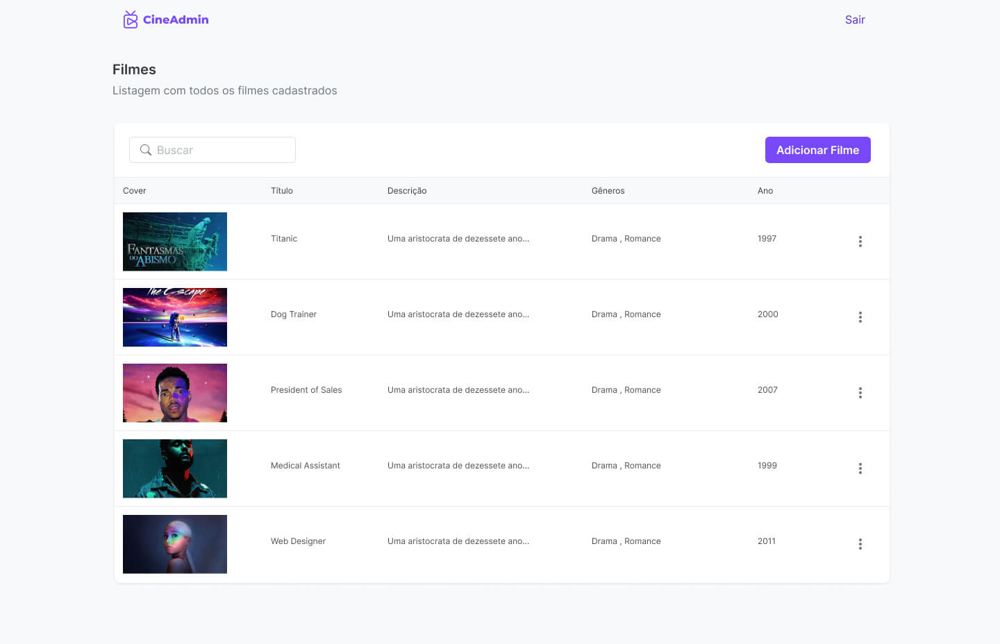

<h1 align="center">
  
</h1>

<h3 align="center">
  Aplicação de gerenciamento de filmes
</h3>

<p align="center">
  

  

  
</p>

<p align="center">
  
</p>

> [Visualizar live demo](https://cine-admin.vercel.app/)

> [Visualizar layout no Figma](https://www.figma.com/file/N7k7hZj4LFHOWT65X66Lvw/CineAdmin-FIAP-Tech-Challenge?type=design&node-id=4492%3A1702&mode=design&t=IUxZESIHD0Z9dC3Z-1)

## Integrantes do Grupo M

Débora Goulart Bartosiaki
debartosiaki@gmail.com

Guilherme Henrry Batista Damasceno
guilhermehenry60@gmail.com

Douglas Soares de Oliveira
soares.douglas.oliveira@hotmail.com

## Sobre

O CineAdmin é um sistema de gerenciamento de filmes com funcionalidades essenciais para administradores. Oferece um sistema de login exclusivo para garantir segurança, permitindo apenas o acesso de administradores credenciados. As principais funcionalidades incluem o cadastro, edição e remoção de filmes, bem como uma busca para facilitar a localização de títulos específicos no catálogo.

### Video do funcionamento da aplicação

https://www.loom.com/share/c18b8538e4354e6f84a7d94aa97e8444?sid=068dbbd1-74f7-4ff4-b964-17196c646214

## Como utilizar

### 1 - Instalar dependências do node

Certifique-se de que você tenha o [Node.js](https://nodejs.org/en) instalado

```bash
npm install
```

### 2 - Criar um arquivo .env a partir do .env.example

Esse arquivo contém as variáveis de ambiente do Supabase, sendo assim, é um passo essencial para o funcionamento da aplicação.

```bash
cp ./src/.env.example ./src/.env
```

### 3 - Iniciar servidor de desenvolvimento

```bash
npm start
```

## Credenciais de acesso

```
Email: admin@cineadmin.com
Senha: admin
```

## Repositório do GitHub

Você pode encontrar o código-fonte e os arquivos relacionados a este projeto no seguinte repositório do GitHub:

https://github.com/Guihenrry/cine-admin
